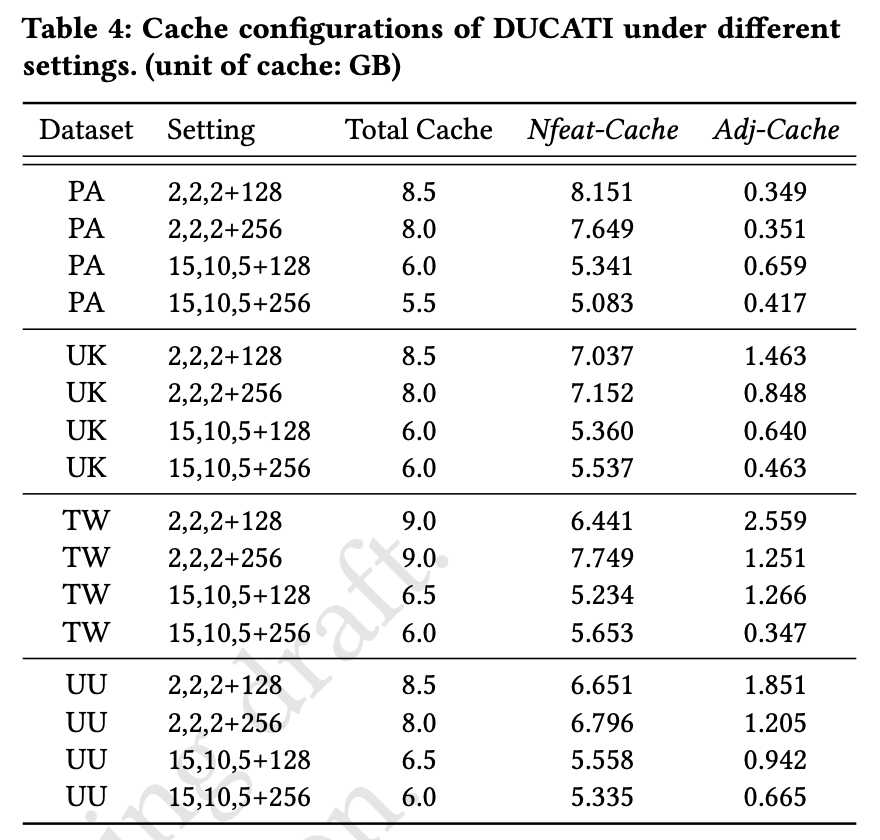

# DUCATI

This repository contains implementation of DUCATI & SOTA and the overall training scripts.
We put the underlying implementations of some APIs in a customized version of DGL (https://github.com/initzhang/dc_dgl.git).

Please follow these steps to prepare environment and datasets:
1. follow the [instructions](https://docs.dgl.ai/install/index.html#install-from-source) to install our [customized DGL](https://github.com/initzhang/dc_dgl.git) from source  
2. install other dependent libraries in `requirements.txt`
3. prepare the datasets: download PA from [OGB](https://ogb.stanford.edu/docs/nodeprop/#ogbn-papers100M), download UK & UU & TW from [GNNLab](https://github.com/SJTU-IPADS/fgnn-artifacts) and [WebGraph](https://webgraph.di.unimi.it)
4. pre-process the datasets using scripts in the `preprocess` directory

Then we can run the experiments under different settings as follows:
```
# verify dual cache allocation plan of DUCATI
CUDA_VISIBLE_DEVICES=0 python run_allocate.py --dataset [DS] --fanouts [FS] --fake-dim [FD] --total-budget [TB]

# verify iteration time of DUCATI using the allocation plan above 
CUDA_VISIBLE_DEVICES=0 python run_ducati.py --dataset [DS] --fanouts [FS] --fake-dim [FD] --adj-budget [AB] --nfeat-budget [NB]

# verify iteration time of SOTA
CUDA_VISIBLE_DEVICES=0 python run_sota.py --dataset [DS] --fanouts [FS] --fake-dim [FD] --nfeat-budget [NB]
```

----

The detailed cache configurations used in the paper:


> While it is possible to determine the `total budget` inside scripts on the fly (run a normal training script without cache, print the `torch.cuda.max_memory_allocated()` after training, then substract the printed value from total GPU memory), we find that it is more flexible to expose `total budget` as a configurable knob during our experiments. 
